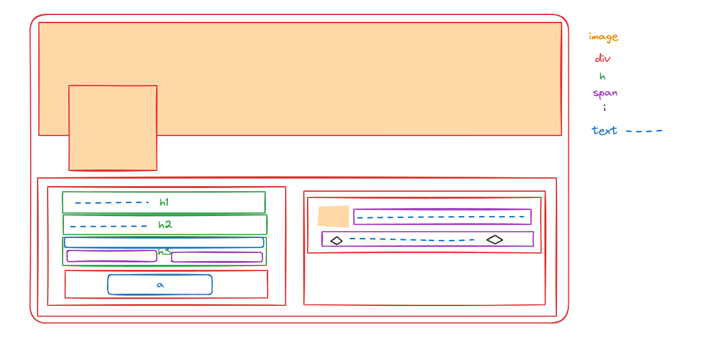
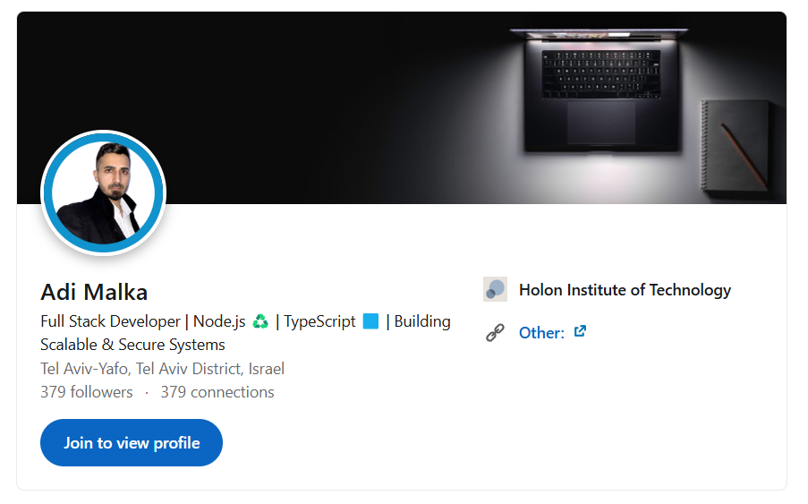

# Profile Demo Project

This is a simple profile page demo created using **HTML** and **CSS**, showcasing basic styling and layout capabilities. The page includes sections for personal details, links, and additional information. Below, you'll find the design plan and original image used for this project.

---
## 🔗 Live Demo
https://adimalka14.github.io/my-linkedIn-profile/
---

## 🎨 Design Plan
Here’s the initial design plan for the project:



---

## 🌄 Original Image
This is the original image used in the project:



---

## 🛠️ Technologies Used
- **HTML5**: Markup for structuring the profile layout.
- **CSS3**: Styling for the layout and design.
- **Live Server**: For easy local development and live preview.

### Tools
- Icons: Provided by FontAwesome
---

## 📖 How to Run the Project
To view the project locally, follow these steps:

1. Clone this repository:
   ```bash
   git clone https://github.com/adimalka14/my-linkedIn-profile.git

2. Install dependencies:
   ```bash
   npm install

3. Run the project:
   ```bash
   npm start

The page will open automatically in your default browser.

